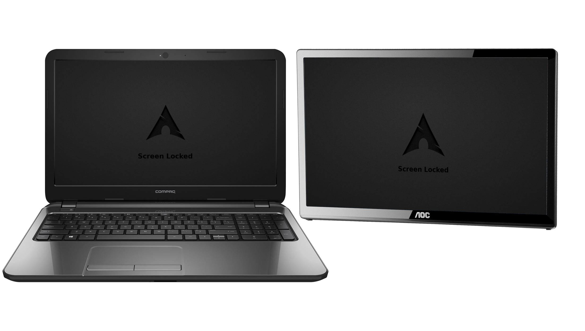

# i3lock-multimonitor
This is a script which uses a background image, resizes it to show correctly on any multimonitor setup.



The idea for this project was shamelessly copied from [guimeira](https://github.com/guimeira)'s [i3lock-fancy-multimonitor](https://github.com/guimeira/i3lock-fancy-multimonitor).

It uses [ImageMagick](http://www.imagemagick.org/) to resize the [background image](./img/background.png). You can replace this image to change background.

By using information from [xrandr](http://www.x.org/wiki/Projects/XRandR/) and basic math, this script supports multiple monitor setups, displaying the background image on all screens.

It caches the generated image for different screen sizes and xrandr output. So even though first `lock` command will take a second to finish, subsequent `lock` will be lighting fast.

## Installation
Make sure you have all the dependencies:
Note - Instructions are for Ubuntu since its the most popular linux distro.
```
sudo apt-get install imagemagick i3lock
```
Copy the `lock` script along with the images to some place on your system (e.g.: the i3 folder) and give it execution permission:
```
git clone https://github.com/shikherverma/i3lock-multimonitor.git
cp -r i3lock-multimonitor ~/.i3
chmod +x ~/.i3/i3lock-multimonitor/lock
```
Create a key binding on your i3 config file (in this example I'm using $mod+p):
```
echo "bindsym \$mod+p exec /home/$USER/.i3/i3lock-multimonitor/lock" >> ~/.i3/config
```
Now reload the i3 configuration file. By default, the key binding is `$mod+Shift+c`.
